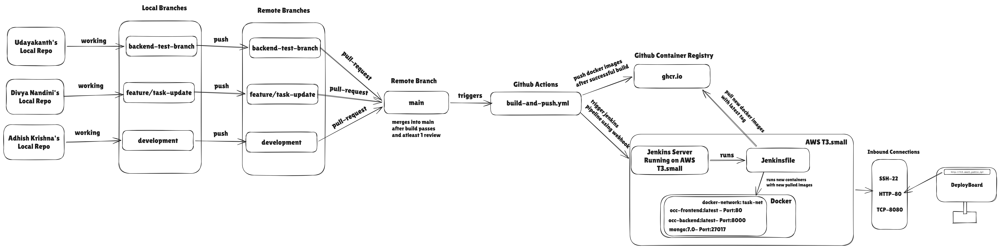

# OCC-TaskManagement

A full-stack task management application developed as a project for a `Deploying Scalable Applications` course. This project demonstrates modern team collaboration practices and a robust DevOps pipeline.

This project is currenlty deployed in AWS T3.small EC2 instance: http://18.60.200.83/


## Team & Contributions

This project was built collaboratively by a team of three members, each focusing on specific areas and utilizing dedicated Git branches:

*   **Udayakanth (23N218)**: Entirely developed the backend architecture, APIs, containerize backend using `Dockerfile` and database interactions. All backend development was done in the `backend-test-branch` branch.
*   **Divya Nandini (23N217)**: Entirely developed the frontend interface, containerize frontend using `Dockerfile`. All frontend development and UI mapping was done in the `feature/task-update` branch.
*   **Adhish Krishna (23N206)**: Set up the DevOps pipeline. Implemented GitHub Actions workflows in `.github/workflows/build-and-push.yml`, the `Jenkinsfile`. This was done in the `development` branch. Created/configured the AWS T3.small EC2 instance for automatic Continuous Deployment. This included installing Jenkins (via Docker) and configuring it to pull and deploy the latest Docker containers upon a push to the main branch.

## Development Workflow & Branching Strategy

To maintain a clean and structured codebase, we adhered to a strict branching strategy:

*   `main`: The production-ready branch. Code from feature branches is merged here only when tested and stable.
*   `feature/task-update`: Dedicated branch for all UI, React components, and frontend logic.
*   `backend-test-branch`: Dedicated branch for the Node.js/Express backend server and MongoDB integration.
* `development`: Dedicated branch for creating github workflows and jenkins file.

All members collaboratively reviewed and merged changes into the `main` branch to trigger the deployment pipeline.

## CI/CD Pipeline (DevOps)


The project leverages a modern, fully automated CI/CD pipeline to ensure seamless integration and deployment.

### 1. Continuous Integration (GitHub Actions)
Whenever code is pushed or a Pull Request is merged into the `main` branch:
*   A GitHub Actions workflow (`.github/workflows/build-and-push.yml`) is triggered.
*   The workflow automatically builds the Docker images for both the `frontend` and `backend` services.
*   The successfully built Docker images are then pushed to the GitHub Container Registry (`ghcr.io`).

### 2. Continuous Deployment (AWS EC2 & Jenkins)
Once the GitHub Action completes successfully, it triggers the deployment stage on our AWS EC2 instance:
*   An AWS `t3.small` EC2 instance runs Jenkins (containerized using Docker).
*   Jenkins executes the `Jenkinsfile` defined in the repository.
*   The Jenkins pipeline pulls the latest `frontend` and `backend` images from GHCR.
*   Jenkins automatically tears down old containers and spins up the new ones (along with the MongoDB container) on a dedicated Docker network (`task-net`).
*   Finally, Jenkins prunes old and unused Docker images to optimize the EC2 instance's storage.

## Local Development (Docker)

To run the entire application stack locally using Docker Compose:

1.  Clone the repository down to your local machine.
2.  Ensure Docker and Docker Compose are installed.
3.  Navigate to the root directory of the project and run:
    ```bash
    docker-compose up -d --build
    ```
4.  The application will be accessible at:
    *   **Frontend**: `http://localhost:8000`
    *   **Backend API**: `http://localhost:5000`
    *   **MongoDB**: `localhost:27017`
